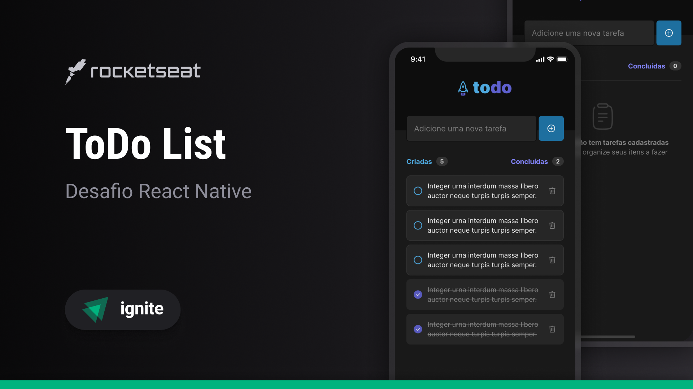

# Todo List (Mobile)

<p align="center">
  <p align="center"><a href="https://github.com/Gabrielingnau/Todo-list">Ver a versão para desktop</a></p>
</p>

<p align="center">
  
</p>

## 💻 Sobre:

Um aplicativo de acompanhamento de tarefas no estilo lista de afazeres (to-do list)

## 🎨 Layout

O layout da aplicação está disponível no Figma:

<a href="https://www.figma.com/file/By8bEIEPXvUkptna6Iv8hm/ToDo-List-%E2%80%A2-Desafio-React-Native-(Copy)?node-id=0%3A1&mode=dev">
  
</a>

## ⚙️ Funcionalidades

- Adicionar uma nova tarefa  
- Marcar e desmarcar uma tarefa como concluída  
- Remover uma tarefa da lista  
- Mostrar o progresso de conclusão das tarefas  

## 🧩 Conceitos Aplicados

- Estados  
- Imutabilidade do estado  
- Listas e chaves no React Native  
- Propriedades  
- Componentização  

## 🚀 Iniciando

Essas instruções permitirão que você obtenha uma cópia do projeto em funcionamento na sua máquina local para fins de desenvolvimento e teste.

## 🔧 Instalação

### Pré-requisitos

Antes de começar, você precisará ter a seguinte ferramenta instalada na sua máquina:  
[VSCode](https://code.visualstudio.com/)  

Também é bom ter uma forma de rodar o projeto no seu celular.  
Você pode fazer isso baixando o aplicativo:  
[Expo Go](https://expo.dev/expo-go)  

Dentro do terminal do VSCode, digite o seguinte código:

```bash
git init

git clone https://github.com/Gabrielingnau/Todo-list-mobile
```
Em seguida, instale as dependências com:

```bash
npm install
```
Depois, basta executar o projeto com:

```bash
npm run start
```

Abra o aplicativo Expo Go no seu celular e clique na opção **"scan QR code"**.  
Em seguida, basta escanear o código QR que aparecerá no terminal do VSCode.

## 🛠️ Construído com

* [React Native](https://reactnative.dev/) - Biblioteca para interfaces de usuário  
* [Expo](https://expo.dev/) - Ferramenta de FrontEnd  
* [Typescript](https://www.typescriptlang.org/) - Sintaxe para tipagem  

---

⌨️ com ❤️ por [Gabriel Lingnau](https://github.com/Gabrielingnau) 😊
